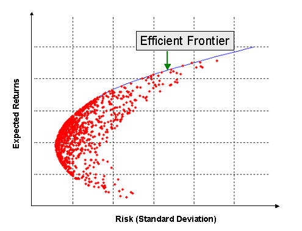

<h1 align="center">Stock Portfolio Optimization App</h1>

## Project Description

This project is a Stock Portfolio Optimization Calculator utilizing various optimization techniques to maximize portfolio performance. It includes graphical visualization of the efficient frontier and portfolio metrics. It is a web-hosted interactive application, hosted using [Streamlit's](https://streamlit.io) functionality.

The project can be found here: [Link to Project](https://stockportfoliooptimizationapp.streamlit.app)

## Portfolio Optimization

The **Portfolio Optimization** process aims to allocate assets in a way that maximizes returns and minimizes risk based on specific criteria. This application supports optimization using:

- **Sharpe Ratio**: Measures the performance of the portfolio compared to a risk-free asset, adjusted for risk.
- **CVaR (Conditional Value at Risk)**: Estimates the expected loss of an investment in the worst-case scenario.
- **Sortino Ratio**: Similar to the Sharpe ratio but only considers downside risk (negative returns).
- **Volatility**: Represents the degree of variation in trading prices, indicating stability.

## Portfolio Optimization Assumptions

The portfolio optimization model makes several assumptions:

- Historical returns are indicative of future performance.
- Asset returns are normally distributed.
- The risk-free rate is known and constant.
- There are no transaction costs.

## The Efficient Frontier

The **Efficient Frontier** represents the set of optimal portfolios that offer the highest expected return for a defined level of risk. It is a key concept in Modern Portfolio Theory. This application leverages multiprocessing to efficiently calculate and plot the efficient frontier.

## The Ticker Tape

The application includes a real-time ticker tape displaying the current prices and changes of top stocks. This feature is implemented be fetching realtime data for top stock tickers from yfinance. The ticker tape shows the latest prices and price changes, scrolling across the screen to provide continuous updates. This is of course just for cosmetic puropses.

## 📝 License

© 2024 [Akaash Mitsakakis-Nath](https://github.com/amitsakakis). 
This project is MIT licensed.

$$
$$
